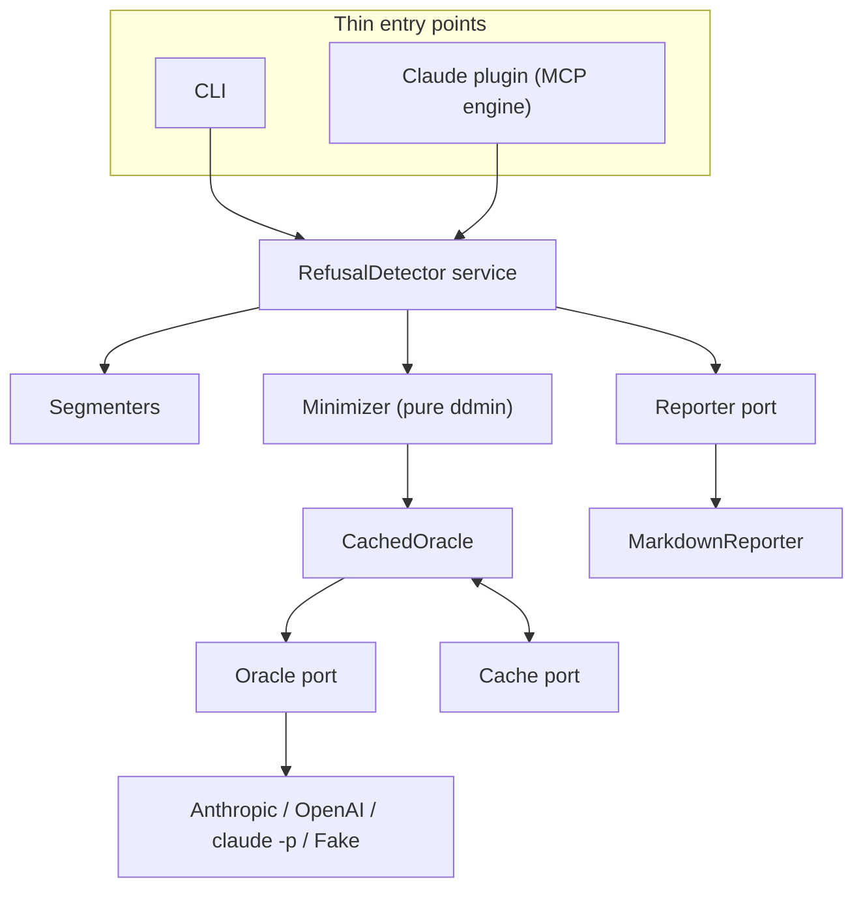

# Claude Refusal Detector — Design

**Status:** Draft — 2026-08-10
**Why:** see [vision.md](./vision.md) — a refusal should come with an answer, not a dead end.

## 1. Problem statement

When a prompt — a line of text, a file, or a full codebase chunk — gets refused by Claude, the
user only sees a generic "I can't help with that": not *which* part of their input triggered it,
not *what kind of guardrail fired*. Often the block is a **false positive** on legitimate content
(e.g. a security writeup, a medical document, a piece of fiction). This tool delivers the
vision's promise: it locates the **minimal set of words, phrases, or sections** that cause the
refusal, reports their exact positions and the **reason class**, and shows what the prompt looks
like without them — so the user can fix it in seconds or file a precise repro.

## 2. Constraints and key decisions

| Constraint | Decision |
|---|---|
| Claude is a closed-weight model | **Black-box only** — no activation/gradient analysis (Inseq, Captum, TransformerLens are not viable). Confirmed in prior research. |
| Multiple model endpoints | **Provider-agnostic `ModelAdapter`**: Anthropic API *and* OpenAI-compatible endpoints. CLI routing: **DeepSeek direct** (`https://api.deepseek.com`); **Kimi 3 / GLM 5.2 via OpenRouter** (`https://openrouter.ai/api/v1`); config maps model → `base_url`. One pipeline, swappable target. |
| In-flow experience (vision: "the moment") | **Claude plugin is the primary surface** — hooks auto-detect the refusal + packaged install; it embeds the **MCP server** (`detect_refusal_trigger` tool) as its engine. The recommendation returns into the chat as the tool result — the "notification". |
| Need to find *minimal* trigger | **Delta debugging** (Zeller's `ddmin`) with a **half-split coarse pass** (binary search over the segments) first. |
| Need to detect a refusal reliably | **Per-provider signals**: Anthropic structured refusal (`stop_reason` / `refusal` block); OpenAI `content_filter` / `refusal`; moderation errors on both; tunable text-pattern fallback. |
| Must be fast and easy to run (vision: accessibility) | **Under-a-minute runs** for typical prompts: single-command CLI, memoized cache, hard call budget. |
| Output must explain, not just report (vision: clarity) | A **reason class** (which guardrail fired) plus a before/after diff — "a trigger, a diff, a reason". |
| Cost / rate limits matter | **Per-session memoized cache** (key = prompt hash) + `ddmin`'s near-optimal call count + optional `--max-calls` budget. |
| Keyless Claude (no API key) | **`ClaudeCodeCLIAdapter`** (`claude -p`, subscription auth) — the **default oracle for the plugin path**, so guardrails match the Claude the user actually hits. |
| Human-readable output | **Markdown report** — trigger, positions, reason class, diff, call count (decided). |
| Extensibility & maintainability | **Ports & adapters**: the core depends on protocols (`Oracle`, `Cache`, `Reporter`, `Segmenter`); entry points are thin; composition via config factories — no globals, no DI framework. |

## 3. Terminology

- **Segment** — an atomic unit of the prompt chosen by the user: line, sentence, paragraph, or
  whitespace token. The prompt is split into an ordered list of segments.
- **Refusal** — any outcome classified as "blocked": structured refusal, or a moderation error,
  or a configured refusal pattern in the text.
- **Trigger** — a *subset* of segments whose presence causes a refusal.
- **1-minimal** — a trigger where removing any single segment makes the refusal disappear.
- **Oracle** — the function `test(prompt) -> bool` (blocked or not). In tests this is a fake with
  a known trigger set; in production it wraps the API.
- **Port** — an interface (Python `Protocol`) the core depends on; **adapter** — a concrete
  implementation of a port (e.g. `AnthropicAPIAdapter`, `JsonFileCache`, `MarkdownReporter`).

## 4. Architecture

**Ports & adapters, kept deliberately simple.** The core depends only on small interfaces
(ports); providers, cache, and renderers are adapters selected by config at startup. Entry
points (CLI, Claude plugin) are thin shells over **one shared application service** — a new
entry point gets the whole pipeline for free.



**Dependency rule:** entry points → `service` → ports; adapters implement ports; the minimizer
and classifier are pure (no I/O, no provider knowledge).

### 4.0 `ports` — the seams

One module defines the contracts plus the shared data types (`Segment`, `Verdict`,
`DetectionReport`):

- `Oracle.test(prompt) -> Verdict` — every model adapter, and `CachedOracle`, implements it.
- `Cache.get/set(hash -> Verdict)` — per-session JSON today, swappable.
- `Segmenter.split(text) -> list[Segment]` — one implementation per splitter.
- `Reporter.render(DetectionReport) -> str` — Markdown today, swappable.

### 4.1 `input_loader` — prompt → segments (`Segmenter` implementations)

- Reads a file path, `--prompt` string, or stdin into text.
- Segmenters implement the `Segmenter` port: `lines` (default), `sentences`, `paragraphs`,
  `tokens` — chosen via `--split`/config. A code-aware splitter can be added later without
  touching the pipeline.
- Every segment carries offsets, so triggers map back to the original file exactly.
- Very large inputs: cap the segment count with a warning (ddmin call count scales with
  segments).

### 4.2 `classifier` — pure verdict logic

Turns normalized response signals into `Verdict(blocked, reason_class)`. Provider-aware but
pure — it never does I/O:

1. **Structured refusal** — Anthropic: `stop_reason == "refusal"` / `type == "refusal"` block.
   OpenAI: `finish_reason == "content_filter"` or a `refusal` field. Highest confidence.
2. **Moderation block** — request rejected by the endpoint (moderation/validation error).
3. **Text patterns** — configurable regexes (`I apologize`, `I can't`, `I'm sorry`, …); lowest
   confidence, user-tunable.

### 4.3 `minimizer` — the delta debugger (pure)

Takes an `Oracle` (a port) and a segment list; returns the 1-minimal trigger. Pure, so it is
provable against a fake oracle (see §9).

- **Phase A (coarse):** repeatedly split the segment list in half and test each half; drop
  unneeded halves.
- **Phase B (fine):** `ddmin` to a 1-minimal trigger.

`ddmin` sketch:

```
ddmin(segments):
    if len(segments) == 1: return segments
    n = 2
    while len(segments) >= 2:
        subsets = chunk(segments, n)
        reduced = False
        for subset in subsets:
            candidate = segments - subset
            if oracle(candidate) is blocked:
                segments = candidate
                n = max(n - 1, 2)
                reduced = True
                break
        if not reduced:
            if n >= len(segments): break
            n = min(len(segments), n * 2)
    return segments
```

Also computes a **"core" analysis**: segments present in *every* minimal trigger are flagged as
the likely root cause (for combination triggers).

### 4.4 `runner` — `CachedOracle` (an `Oracle` adapter)

Wraps a real model adapter and adds the cross-cutting concerns in one place:

- Retries and rate-limit backoff (`429`/`529`).
- **Per-session memoized cache** (hash → verdict) via the `Cache` port — the main cost control.
- `--max-calls` budget; on exhaustion, reports the best partial result. Budget counts distinct
  prompts; retries of the same prompt don't consume it.
- **Fail loud:** any adapter error (auth, network, malformed response) raises and logs — a failed
  test is never silently treated as "not blocked".

Because `CachedOracle` *is* an `Oracle`, the minimizer never knows caching exists.

### 4.5 `adapters` — provider & infrastructure implementations

- `AnthropicAPIAdapter` — Anthropic Messages API; structured refusal + moderation errors.
- `OpenAIAdapter` — OpenAI-compatible; **CLI routing: DeepSeek direct
  (`https://api.deepseek.com`), Kimi 3 / GLM 5.2 via OpenRouter
  (`https://openrouter.ai/api/v1`)**; config maps model → `base_url`; parses
  `content_filter`/`refusal`/moderation errors.
- `ClaudeCodeCLIAdapter` — `claude -p "<prompt>"` (subscription, keyless); **default for the
  plugin path** so guardrails match the session; heavier per call.
- `FakeOracleAdapter` — known trigger set, for tests.
- `JsonFileCache` — per-session cache file.
- `MarkdownReporter` — the `Reporter` implementation.
- All HTTP adapters share one client (`httpx`, sync) with common timeouts and the runner's
  retry policy.

### 4.6 `service` — the single use case

`RefusalDetector.detect(prompt_or_path, config) -> DetectionReport` (plus
`check(prompt, config) -> Verdict`):

1. Load text and segment it (via a `Segmenter`).
2. Minimize against a `CachedOracle` built from config.
3. Render the `DetectionReport` via the configured `Reporter`.

The CLI and the MCP plugin both call this — one use case, many entry points. Composition is
plain factory functions in `config.py` (`build_oracle`, `build_cache`, `build_reporter`): no
globals, no DI framework. Config is a dataclass loaded from env/`.env`; API keys come from
environment variables and are never committed.

### 4.7 `report` — the output contract

`DetectionReport` is a pure data object; `MarkdownReporter` renders it as **Markdown** (decided),
delivering "a trigger, a diff, a reason":

- The minimal trigger text, with segment positions. — *the trigger*
- The **reason class** — which guardrail fired. — *the reason*
- The diff: original prompt vs. trigger removed. — *the diff*
- The verdicts observed and total API calls made.
- Whether the trigger is **necessary** (removing it un-blocks).
- The **repro payload** (model, exact trigger, verdicts) so the report doubles as a bug report.

### 4.8 `desktop_plugin` — Claude plugin first, MCP as its engine (vision: "the moment")

**Priority: the Claude plugin is the primary surface** (the user's main usage). Two layers:

1. **Claude plugin (primary)** — a packaged plugin (manifest + hooks) installed into Claude.
   Hooks provide the automatic trigger the vision needs: when a refusal happens, the plugin
   fires, runs `service.detect` on the blocked prompt, and returns the recommendation into the
   chat (the "notification"). Packaging/manifest gives one-command install for non-technical
   users.
2. **MCP server (engine, secondary)** — exposes `detect_refusal_trigger` (blocked prompt/file
   in → recommendation out). The plugin embeds this as its tool substrate, and it is also
   usable standalone in Claude Desktop/Code.

Both call the same `service.detect` — no logic is duplicated, and the core stays testable
without either. Responsiveness target: **seconds** (vs. the CLI's under-a-minute bar).

**Honest constraint:** neither the plugin hooks nor the MCP server can invoke the host's own
model programmatically — the *testing loop* still needs a configured oracle. The plugin path
**defaults to the keyless `claude -p` adapter** (same Claude, same guardrails); an Anthropic API
or OpenAI-compatible endpoint also work. The plugin's convenience (auto-trigger, in-chat
notification) is keyless; the oracle is not.

## 5. Project layout

```
claude-refusal-detector/
├── README.md
├── pyproject.toml
├── .env.example
├── src/refusal_detector/
│   ├── __init__.py
│   ├── ports.py          # protocols: Oracle, Cache, Reporter, Segmenter + data types
│   ├── config.py         # Config dataclass + env loading + build_* factories
│   ├── service.py        # RefusalDetector — single use case (CLI + plugin call this)
│   ├── input_loader.py   # Segmenter implementations (lines/sentences/paragraphs/tokens)
│   ├── classifier.py     # pure verdict logic
│   ├── minimizer.py      # pure ddmin + half-split
│   ├── runner.py         # CachedOracle (cache + retries + budget) — implements Oracle
│   ├── adapters.py       # Anthropic/OpenAI/claude -p/Fake + JsonFileCache + MarkdownReporter
│   ├── cli.py            # thin entry point
│   └── desktop_plugin.py # thin MCP entry point
└── tests/
    ├── test_minimizer.py
    ├── test_classifier.py
    ├── test_input_loader.py
    └── test_runner.py
```

## 6. Refusal classification matrix

| Signal | Provider | Meaning | Confidence |
|---|---|---|---|
| `stop_reason == "refusal"` | Anthropic | Model refused | High |
| content block `type == "refusal"` | Anthropic | Model refused | High |
| `finish_reason == "content_filter"` | OpenAI | Content filter fired | High |
| `refusal` field in response | OpenAI | Model refused | High |
| Moderation/validation error | Both | Input-side block | High |
| Text pattern match | Both | Probable refusal | Low (tunable) |

## 7. Cost & rate-limit model

- **Cache-first:** identical prompts (same hash) are never re-sent. `ddmin` re-tests overlapping
  subsets, so the cache is where most savings come from.
- **Near-optimal calls:** `ddmin` is $O(\log_2 n)$–ish for single-trigger cases (worst case
  $O(n)$); the half-split phase keeps it smaller on average.
- **Budget:** `--max-calls` hard stop with a partial-result report.
- **Model choice:** user-configurable per provider (`claude-*` / `gpt-*` / gateway model); the
  search uses the same model as the final confirmation so guardrail behavior matches what the
  user actually hit.

## 8. Scope boundaries (explicit non-goals)

This project is a **diagnostic tool** (vision: "diagnosis only — it explains what triggered a
block, and that is all"). Everything below follows from that identity.

- **No guardrail evasion.** This tool *diagnoses* which content triggers a refusal; it does not
  help sneak content past filters. Specifically, the previously-discussed idea of
  **Base64-encoding a payload to bypass input guardrails and decoding it in-memory** is **out of
  scope** — that is an evasion technique, not diagnosis. All testing goes through the standard API
  path with normal, plain-text prompts.
- **No jailbreak generation.** We locate triggers; we don't emit "bypass prompts."
- **Not a safety filter itself.** No blocking/scanning of other prompts.

Legitimate uses this serves: resolving false positives on benign content, understanding why a
documentation page or code comment is blocked, and (for model teams) red-teaming to harden
guardrails.

## 9. Verification strategy

Per repo verification discipline ("prove the seam, not the halves"):

1. **Unit — minimizer vs. fake oracle.** Build a `FakeOracleAdapter` with a *known* trigger set;
   assert `ddmin` recovers exactly that set and that the result is 1-minimal. This proves the
   algorithm against a ground truth that encodes reality, not our belief about the API.
2. **Unit — classifier.** Feed canned API responses (structured refusal, moderation error, plain
   text) and assert verdicts.
3. **Unit — input loader.** Assert offsets map back to the original file exactly (round-trip
   property).
4. **Integration — real round trip.** One fixture with a known trigger, real API key: run
   `detect`, assert the report names the exact segment and that removing it un-blocks. If no API
   key is available in CI, this is a documented manual step, never silently skipped green.
5. **Mutation check.** Break the known trigger set → the specific test must go red; restore → green.
6. **Unit — service.** `service.detect` with a fake oracle, in-memory cache, and stub reporter
   returns a complete `DetectionReport` — proves the wiring of the single use case with no
   network.

## 10. Decisions and remaining questions

**Decided (aligned with the user):**
- Default segmentation: **lines** (best for codebase scanning, the user's primary case).
- Report format: **Markdown** only.
- Cache lifetime: **per session** (no cross-run staleness).
- Plugin mechanism: **Claude plugin first** (auto-trigger hooks + packaged install), with the
  **MCP server as its engine** (also usable standalone); recommendation surfaces in the chat.
- v1 scope: **single-prompt / single-file** diagnosis only — no batch red-teaming. The purpose
  is avoiding false-positive blocks on legitimate content, not probing model vulnerabilities.
- Providers: **Anthropic API + OpenAI-compatible endpoints** + keyless `claude -p` adapter.

**Resolved — endpoint routing (decided):**
- **Plugin path** (Claude Desktop / Claude Code): the oracle is the keyless `claude -p` adapter —
  same Claude, same guardrails the user actually hit.
- **CLI path**: all through the `OpenAIAdapter` — **DeepSeek direct** (`https://api.deepseek.com`),
  **Kimi 3 and GLM 5.2 via OpenRouter** (`https://openrouter.ai/api/v1`). Config maps each model
  to its endpoint (`base_url`).

**Remaining questions:**
1. For the codebase case, should `detect <file>` also accept a **directory** (scan candidate
   files) in a later iteration, or is file-at-a-time enough for v1?
