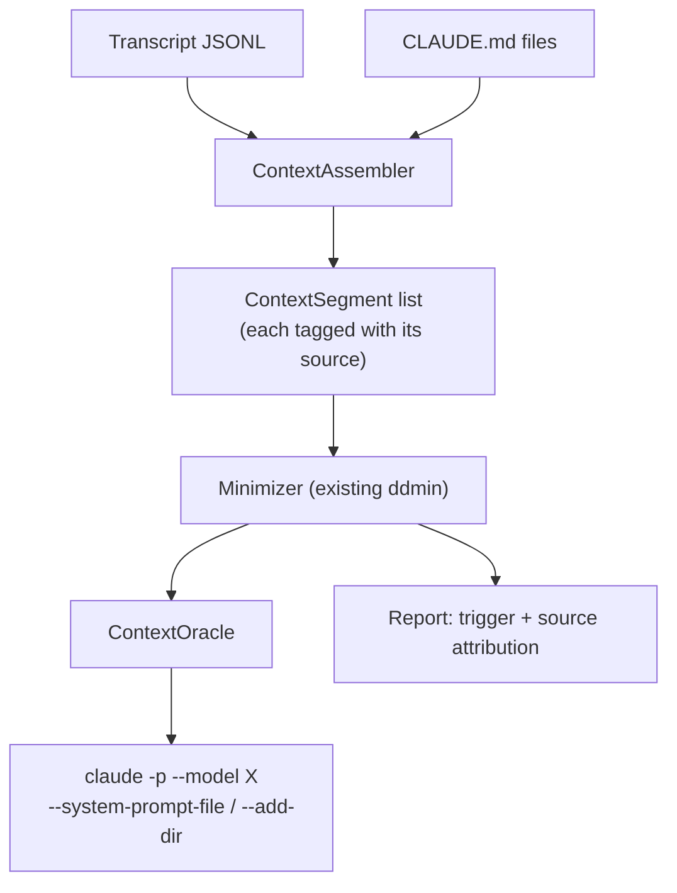

# Context-Aware Refusal Diagnosis — Design

**Status:** Draft — 2026-08-12
**Supersedes scope of:** [`docs/design.md`](../../design.md) §4.1 (prompt-only input), §4.8 (plugin surface)
**Depends on:** [`docs/design.md`](../../design.md) for ports & adapters, ddmin, reporting

## 1. Why this redesign

`docs/design.md` assumes the thing to minimize is **one prompt**. Field evidence from
2026-08-11/12 shows that assumption does not hold for the case the tool exists to serve.

A real refusal captured in a live session:

```
22:15:23  user prompt (375 chars)
22:16:35  *** model_refusal_fallback ***  claude-fable-5 -> claude-opus-4-8   category=cyber
22:17:56  (fallback model resumes; thinking / tool_use)
22:17:59  first tool_result (4860 chars)
```

The refusal fired **84 seconds before any file content existed**. So the trigger was in the
opening request: the user's prompt plus whatever the session injected ahead of it — in this
case a project `CLAUDE.md` of 12,710 chars. Minimizing the prompt alone can never find it.

### 1.1 Corrections to earlier claims

Both recorded here because they were reported as fact and were wrong:

- **"The fetched file content caused the refusal."** False. Inferred from a whole-file byte
  count without checking record ordering; timestamps disprove it.
- **"A probe takes 12.1s and the prompt is not blocked."** Invalid. Every probe was returning
  `Not logged in · Please run /login` (exit 1). `claude auth status` reports
  `{"loggedIn": false, "authMethod": "none"}`. The 12.1s was auth-failure latency, and the
  budget arithmetic in 0.3.3 rests on a meaningless number.

## 2. What can be blocked

The request the model refuses is assembled from several sources. The tool must treat all
*reconstructable* ones as candidate triggers:

| Source | Reconstructable | Where from |
|---|---|---|
| Current user prompt | Yes | transcript |
| Prior conversation turns | Yes | transcript |
| Tool results already returned | Yes | transcript |
| Project `CLAUDE.md` | Yes | file at session `cwd` |
| Global `~/.claude/CLAUDE.md` | Yes | file |
| Claude Code's base system prompt | **No** | not exposed |
| Exact tool definitions | **No** | not exposed |

**Consequence:** the trigger may be a *combination* spanning sources (a prompt line plus a
`CLAUDE.md` line, neither alone). ddmin handles combinations natively, but only if every
candidate source is in the input set. That is the core change.

**Honesty requirement:** the reconstructable universe is not the whole request. When
minimization finds no trigger, the report must say the trigger may lie in the
non-reconstructable remainder rather than implying the content is clean.

## 3. Oracle decision

Three options were evaluated. **Decision: keyless `claude -p`** (user's choice, 2026-08-12).

| Option | Verdict |
|---|---|
| MCP sampling (`sampling/createMessage`) | **Unavailable.** In the MCP protocol and in our server SDK, but Claude Code does not implement it as a client: [issue #1785](https://github.com/anthropics/claude-code/issues/1785) open since June 2025, and `sampling` appears nowhere in the official MCP docs, which do document the sibling `elicitation`. |
| Anthropic Messages API | Cleanest — sends only the bytes under test. Rejected: requires a paid API key. |
| **`claude -p` (chosen)** | Keyless, on the existing subscription. Carries its own ambient context, which is both the drawback and, handled correctly, an asset (§3.1). |

### 3.1 Turning the confound into a control

`claude -p` injects its own system prompt and auto-discovers `CLAUDE.md` from its working
directory. Naively this poisons results: the probe measures "content under test **plus**
whatever ambient context the CLI loaded", varying by directory.

The CLI exposes flags that make that ambient context an *input we control*:

- `--system-prompt` / `--system-prompt-file` — replace the system prompt
- `--append-system-prompt` / `--append-system-prompt-file` — add to it
- `--add-dir` — controls which directories contribute `CLAUDE.md`
- `--exclude-dynamic-system-prompt-sections` — drop per-machine sections (cwd, env, git status)
- `--model` — probe the model that actually refused (guardrails are model-specific)

Held fixed across every probe in a run, ambient context stops being a confound and becomes a
constant. Where a candidate segment *is* pre-prompt material, it is injected through
`--append-system-prompt-file` so it occupies the same position as in the real request.

### 3.2 Prerequisite: the CLI must be authenticated

`claude auth status` currently returns `{"loggedIn": false, "authMethod": "none"}`.
`~/.claude/.credentials.json` holds only MCP OAuth tokens; no account token exists. The
desktop app's session does not share credentials with the CLI binary.

The user must run **`claude setup-token`** once — a long-lived token, which is the form a
hook-spawned non-interactive probe needs. Until then no diagnosis is possible.

**This is a hard precondition, and the tool must state it rather than work around it.**

## 4. Architecture

The ports & adapters core is unchanged. Three things change: what gets segmented, how a
candidate is replayed, and what happens when the oracle cannot answer.



### 4.1 `ContextAssembler` — new

Reads a transcript plus the `CLAUDE.md` files that applied, and returns an ordered list of
segments. Each segment carries its **origin** (`prompt`, `tool_result`, `project_claude_md`,
`global_claude_md`, `prior_turn`) alongside the existing offsets.

Origin is what makes the report actionable: "the trigger is line 340 of your project
CLAUDE.md" is a fix; "the trigger is line 340" is not.

Assembly stops at the refusal record — content that arrived afterwards was not in the refused
request (§1). This is the specific error that motivated the redesign, so it is a stated
invariant, not an implementation detail.

### 4.2 `ContextOracle` — new adapter

Wraps `ClaudeCodeCLIAdapter`. Given a candidate subset, routes each segment to the channel
matching its origin — pre-prompt segments to `--append-system-prompt-file`, conversation
segments to stdin — then returns the `Verdict`. Holds all other ambient context fixed (§3.1).

### 4.3 Fail-loud (blocking defect, fix first)

`ClaudeCodeCLIAdapter` currently returns "not blocked" whenever the CLI fails, because a
non-zero exit only counts as a block if the output happens to contain `refus`/`blocked`:

```python
if res.returncode != 0 and ("refus" in output.lower() or "blocked" in output.lower()):
    return self.classifier.classify_moderation_error(output)
return self.classifier.classify_text(output)   # "Not logged in" lands here -> not blocked
```

Every diagnosis produced while logged out is a false negative wearing a clean report. This is
the same C2 defect [`docs/review-report.md`](../../review-report.md) fixed for the HTTP
adapters, still present here. A non-zero exit must **raise**, per `docs/design.md` §4.4.

A preflight `claude auth status` check runs once per session and fails with the
`claude setup-token` instruction rather than probing into a guaranteed-useless result.

### 4.4 Cost

Measured 2026-08-13, post-authentication, with 3 real `claude -p` probes via
`SystemPromptCLIAdapter`: 19.6s / 21.2s / 24.5s (mean 21.8s, max 24.5s). The earlier 12.1s
figure (section 1.1) was auth-failure latency, not real probe cost, and is void.

Budget arithmetic: `_HOOK_MAX_CALLS * max_probe_seconds * 1.3` headroom, rounded up to the
next 10s, plus a fixed 20s margin for the hook timeout. At the previous
`_HOOK_MAX_CALLS = 10` this needs `10 * 24.5 * 1.3 = 318.5` -> 320s budget -> 340s hook
timeout, past the 300s ceiling a blocking Stop hook may hold a session for. 9 still does
not fit (`9 * 24.5 * 1.3 = 286.65` -> 290s budget -> 310s timeout). `_HOOK_MAX_CALLS = 8`
is the largest count that fits: `8 * 24.5 * 1.3 = 254.8` -> 260s budget -> 280s hook
timeout. Completeness (2 fewer probes) is traded for a bounded stall rather than letting
the timeout climb past 300s.

Structure that does not depend on the number:

- Coarse-to-fine by origin: test whole sources first (prompt / CLAUDE.md / tool results) to
  find which contains the trigger, then minimize only inside it. On the captured case this is
  ~3 probes to localize before line-level work begins.
- The existing per-session cache and `--max-calls` budget already apply.
- The Stop hook stays automatic: with the measurement above it fits inside a bounded 260s
  budget and reports whatever it found before the watchdog fires, rather than being dropped
  in favour of an on-demand-only MCP tool.

## 5. Verification

Per the repo's discipline — prove the seam, and never infer absence from a failed tool:

1. **Preflight:** `claude auth status` parsed; logged-out state produces the setup instruction,
   asserted by test.
2. **Fail-loud:** non-zero CLI exit raises; "Not logged in" specifically must never classify as
   not-blocked. Regression test with the captured real output.
3. **Assembler ordering:** built from the real captured transcript, asserting content after the
   refusal record is excluded.
4. **Origin attribution:** a synthetic trigger planted in a `CLAUDE.md` fixture is reported as
   originating there, not in the prompt.
5. **Real round trip (the seam):** once authenticated, reproduce the captured `cyber` refusal
   end-to-end and assert the reported trigger, then assert removing it un-blocks. If it cannot
   be reproduced, that is a finding to report — not a silent pass.
6. **Mutation:** each new test falsified green→red→green.

## 6. Scope boundaries

Unchanged from `docs/design.md` §8: diagnosis only. Reporting which text triggered a guardrail
so a false positive on legitimate work can be rephrased or filed — not evasion, not jailbreak
generation. Surfacing that a `CLAUDE.md` line triggers a classifier serves the same end as
surfacing it for a prompt.

## 7. Open questions

1. **Automatic vs on-demand** — settled once per-probe cost is measured (§4.4).
2. **False-positive rate of the text-pattern classifier** — 5 of 8 benign phrasings classified
   as refusals. With the structured API signal now available and authoritative, the patterns
   may be demotable to a fallback used only when no structured record exists, or removed.
